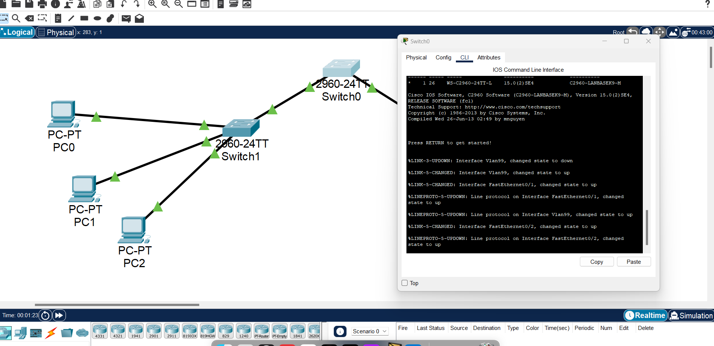
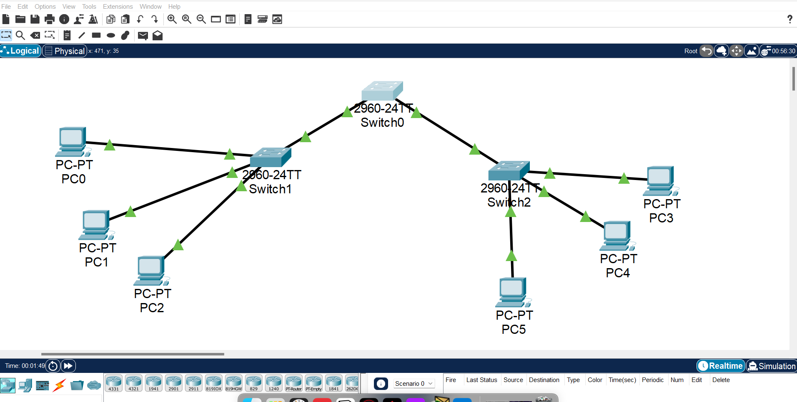

# BASIC VLAN CONFIG - FINAL

## Complete Documentation

READ 
[PDF](./F-VLAN_Doc.pdf)

This is a network which use static routing and vlans to hierarchy the devices

## Requirements

You need:
* Cisco Packet Tracer 8.1.1

## Installation

Download the project or clone the repository. 
Then open "b_VLAN.pkt" file.

## Run

Test the network click whatever PC go to "Desktop" tab, select "Command Prompt" and type one of the next commands

```bash
ping <IP>
```
## Views
Command Prompt


Network


And That's all 
~ Rawier 💜